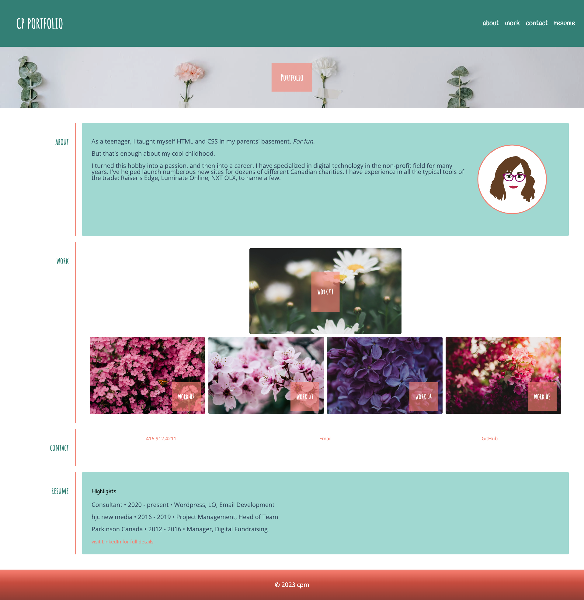

# CP Portfolio Challenge 02

## Description

Developed a one-page portfolio to showcase my work history and examples of projects that have been completed. Code was created from scratch. 

- include a photo or avatar
- ensure links in navigation scrolls to correct section
- work images open a link to a new page
- responsive behaviour for all sections

## Usage

File can be downloaded and used to gain inside into refactoring code and applying accessibility standards. 

## Credits

www.pexels.com free stock images

## License

- GitHub repository URL: https://github.com/cherah-petra/CP-Portfolio-Challenge-02/
- License: license.txt

